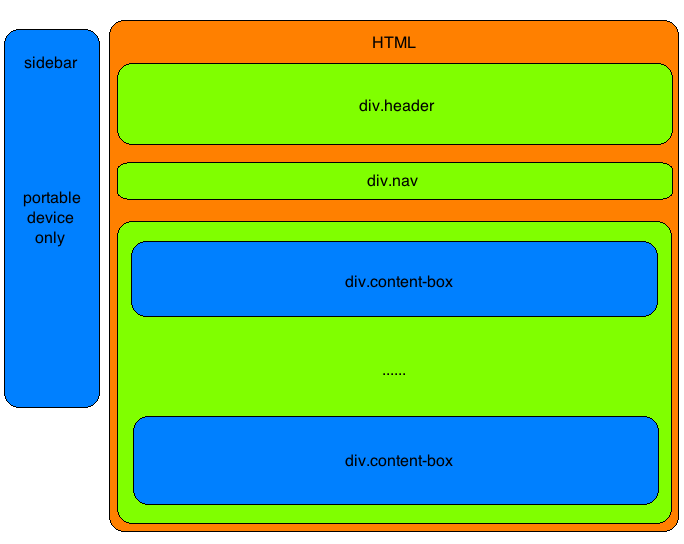

#个人主页
##web前端开发 基础实验1

吕梦扬 软42  
2014013452  
lmy1229@126.com

###1.实验要求
####1.1 基础要求

结合课上所学HTML/CSS基础,设计实现自己的个人主页,需要包含若干内容.具体要求如下:

- 个人的介绍. 需要有照片/头像, 自我介绍以及联系方式
- Web前端课程作业的展示区. 用于放置每次课程的作业
- 个人日志. 本次课程要求发一篇
- 利用所学知识进行布局, 要求整体协调美观, 使用方便, 符合大多数人的审美, 内容丰富. 支持**Chrome**, **Safari**, **Firefox**等主流浏览器.
- 说明文档

####提高要求

- 利用**Grunt**或者**Gulp**编写构建脚本,实现html,css压缩功能.
- 对网页进行响应式设计,使得在不同的屏幕大小下都能够展现出作家效果.

###2.完成与实现
####网页设计
总体设计参照下图

- `div.header`显示了网页头部的图片以及网页的标题
- `div.nav`是网页的导航栏. 导航栏上分为3个部分: *home*, *blogs*和*homeworks*.
- `div.content-box`是网页上一个个的条目,显示每一条的标题和相应的简略介绍. 点击标题能够进入相应的网页查看细节.
- `sidebar`是专门为小屏幕移动设备设计的元素, 在大屏幕设备上会隐藏. 平常时候`sidebar`会放在屏幕外的左边, 当用户点击导航栏`div.nav`上的某一个按钮时,便会激活移动到屏幕中.具体实现见后.

根据设计实现的网页如下:

####网页的自适应设计
网页的自适应分为两种:

1. 网页上的元素的大小随着屏幕宽度的改变实时改变, 通过在CSS中设置`width = 100%`或`width = 80vw`等语句来实现. 在这种情况下, 只是元素的大小在改变, 整体的布局并没有改变, 而是保持原样
2. 网页的**CSS**中使用了`@media`语句来进行自适应布局. 当前的规则是: 

	- 当屏幕宽度大于`540px`时,认为屏幕足够宽敞,可以完整显示.
	- 当屏幕宽度小于`540px`时,认为是移动设备(手机等),需要改变页面的布局
	
本网页对于小屏幕的重新布局主要体现在导航栏`div.nav`上. 当屏幕宽度太小时, 页面中的文本内容可以换行, 对于视觉效果的影响比较小. 但是导航栏上的元素如果换行,就会对页面产生较大的影响. 因此, 在本网页上, 当网页察觉到环境是小屏幕时, 就会禁用掉`div.nav`上的原本3个元素, 启用`sidebar`. 当用户点击导航栏上的`≡`按钮时, `sidebar`会从网页的外部移动到网页中,替代原本导航栏的作用. 实现效果如下

 

####浏览器兼容性
经过测试, 本网页能够在**Safari**,**Chrome**和**Microsoft Edge**浏览器上完美运行, 在**Firefox**和**Internet Explorer 11**上完美显示界面,但是在移动端上某一些CSS动画无法正确播出, 但是不影响使用

###3.未来展望
1. 在**Firefox**和**Internet Explorer 11**上部分CSS动画没有播放过程直接显示结果,且在`homeworks`界面用于显示作业报告的`iframe`的高度计算有问题. 这些bug需要修复
2. 现在的网页还很原始, 所有页面都是通过html写死的. 这样既不方便也不利于网页的课扩展性. 将来需要使用新学到的技术继续完善个人主页

###4.发布地址
本网页发布于[lmy1229.github.io](https://lmy1229.github.io), 网页源码在[这里](https://github.com/lmy1229/lmy1229.github.io)