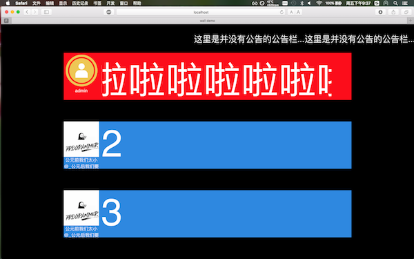
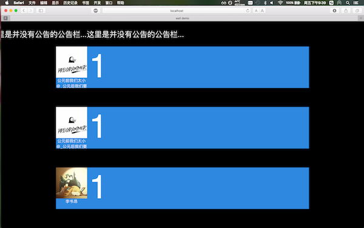

#基础实验4: 聊天墙

吕梦扬  
2014013452  
<a href="mailto:lmy1229@126.com">lmy1229@126.com</a>

----------------------------------------------

##实验目的

1. 了解并练习使用Ajax
2. 学习使用HTML5的新型特性
3. 学习WebSocket的使用

##实验内容
- 基础要求
	- 正确地在页面上显示3-5条消息
	- 能够显示用户昵称和头像
	- 有合适的图片加载动画
	- 有新的消息时更新页面
	- 公告栏
	- 刷新时显示历史消息
	- 适配不同的屏幕
	- UI设计
	- 为新消息的加入和就消息的消失加入动画
	- 管理员账号消息显示

- 提高要求
	- 显示emoji和微信表情
	- 使用数据绑定模型
	
----------------------------------------------
##微信聊天墙展示

##实现细节
###依赖库
1. 通过[`socket.io`](http://socket.io)连接`Websocket`,接受`new message`和`admin`事件,并分别处理.
2. 使用[`jQuery`](http://jquery.com)来完成一些基本的选择器和动画.
3. 使用[`Vue.js`](http://vuejs.org),将网页上的3个显示条的数据(昵称和文本内容)绑定到js中的数据.于是每次接收到WebSocket的事件,只需要修改Vue中的数据即可完成网页上的数据的更新.

###长文本自动滚动
4. 长文本自动滚动显示的功能:
	- 向`String.prototype`中添加一个方法`width(font)`,用来计算一个字符串在`font`这个字体设置下的显示宽度.具体实现方法为: 使用jQuery创建一个`div`节点包含这个字符串,设置`div`的字体设置,并设置透明显示,然后将这个节点添加到`$('body')`上,使用jQuery的`.width()`来获取这个`div`的宽度.这就是结果.最后将这个节点再删掉.([来源](http://blog.csdn.net/ybdesire/article/details/50018747))
	- 每次获得一个新的数据,首先调用`width`函数获取它的宽度, 如果不是特别宽,则设置Vue中的一个变量`show`为true,表示静态显示这个消息,否则设`show`为false,表示滚动播放这个消息.
	- 对于每一个消息条目,其中有两个DOM节点显示消息的内容,一个是正常的\
标签表示静态呈现,另一个是\
标签表示滚动播放. 两者之间通过Vue中的`v-if`和`v-else`属性绑定到`show`变量中.`show`为true表示显示前者,false表示显示后者.

###事件响应
4. 接受到`new message`事件后完成的任务有:
	- 调用动画,具体见第6条
	- 在动画结束的回调函数中, 更新Vue中的数据,异步加载头像.
	- 更新自定义的数据
5. 接收到`admin`后,为了实现admin能够在顶端保持一定时间不被新的普通消息覆盖,需要设置一个计时器.因此接收到事件后,需要做的事情有:
	- 查看是否已经设置了一个计时器且没有到时间.如果有,那么删除这个计时器.
	- 新建一个计时器,时间为10s, 设置完成的回调函数为删除计时器.
	- 将显示在网页最上端的条目使用动画淡出,然后更改其中的内容,修改背景图片,重新淡入.
	
###动画
6. 更新动画的实现:
	- 定义屏幕上显示的条目顺序到实际DOM元素排列顺序的映射`contentAtIndex`,`contentAtIndex[i]`表示在屏幕上显示的第i条实际是DOM元素中的第几个.
	- 首先判断是不是处于Admin消息的计时时间内,如果是,则定义初始点`start`为1,否则定义初始点为0.
	- 将第`contentAtIndex[start]`的DOM元素使用CSS动画移动到最后一条的位置, 然后将之后的元素依次向前移动一个位置.如下图
	
7. 长文字滚动('.marquee')的动画的实现:
	- 可以使用HTML自带的\<marquee>标签来滚动显示.但是marquee的控制比较单一,并且动画效果不好,因此需要自己手动实现一个`.marquee`的标签
	- 使用css3的transition动画和translate函数,将文本从最右方移动到最左方,不断循环.
	
###刷新页面时显示历史信息
- 使用`jQuery`的`get`函数,在页面被加载时,向服务器请求3个历史数据,并且显示在页面上

###头像异步加载的功能
- 为img标签添加css样式`background: url('loading.gif') 50% no-repeat;`,使得当一个img没有设置`src`属性时,能够显示背景图片为一个正在加载的gif.
- 当获得一个新的头像url的时候,使用js生成一个新的Image对象im,在im的`onload`事件中,将url赋给页面中的img的`src`属性.
- 于是在im对象在加载图片的时候,img标签在显示背景(loading.gif),当im对象下载图像完成之后再改变img标签的`src`属性,浏览器就会直接加载图片而不再下载(因为这张图片已经被im对象下载好了).
- ([来源](http://blog.teamtreehouse.com/learn-asynchronous-image-loading-javascript))
- (由于现在网速比较快,加上新消息加入时有动画延迟,因此在页面上基本看不到图片加载的过程.只有在刷新网页,网页读取历史信息的时候loading.gif会出现一瞬间)

###[发布链接](https://lmy1229.github.io/homeworks/4/)